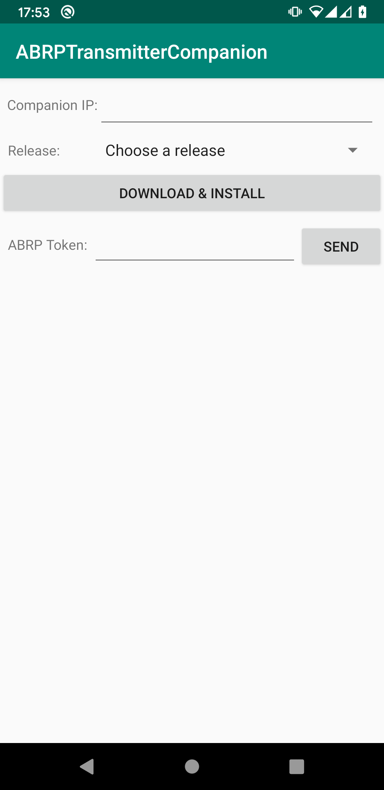

# ABRPTransmitterCompanion

Allows you to easylie send your ABRP token to your headunit running ABRPTransmitter 

Getting started: 
Simply insert the IP address ABRPTransmitter is showing on your cars headunit and your token. Finally press send. 
Make sure your smartphone and your car are on the same WiFi.

If you like my work I'd be happy if you buy me a coffee. Thanks! 

